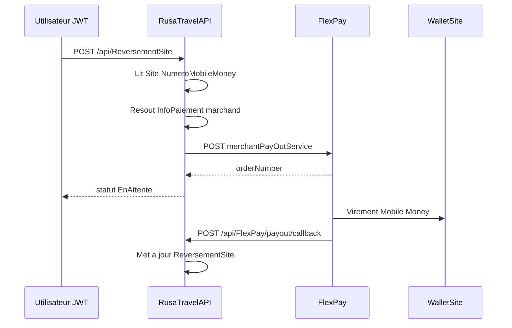
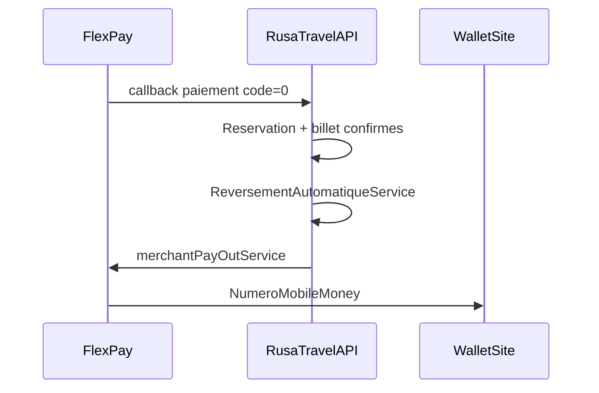

# Documentation d'integration - Module Multi-devise

> **Guide portable (autre projet)** : voir à la racine du dépôt  
> [`Integration-MultiDevise-From-RusaTravelAPI.md`](../../../Integration-MultiDevise-From-RusaTravelAPI.md)  
> (architecture, SQL, algorithmes, checklist de portage).

## 1) Objectif

Ce document explique comment integrer le module multi-devise dans les applications web/mobile avec l'API RusaTravel.

Le module couvre:
- la gestion des devises par societe
- la devise principale (une seule par societe)
- la gestion des taux de change
- la conversion de preview
- l'impact sur les voyages, paiements, remboursements, reversements site (FlexPay PayOut) et reporting

---

## 2) Regles metier principales

- Une societe a **une seule** devise principale (`Societe.CodeDevisePrincipale`).
- Une devise est creee par societe (`IdSociete`).
- Une devise est unique par societe: `(IdSociete, CodeDevise)`.
- Une devise principale doit etre active.
- On ne peut pas desactiver la devise qui est actuellement principale sans basculer d'abord vers une autre devise.
- Les montants financiers sont en double:
  - devise d'origine (saisie/metier)
  - devise principale (consolidee)

---

## 3) Authentification et autorisation

Tous les endpoints du module devise sont proteges:
- Roles autorises: `Admin`, `Super-Admin`, `Gerant`
- `Super-Admin`: scope global
- `Admin`/`Gerant`: scope limite a leur societe

Route de base du module:
- `api/Devise`

---

## 4) Endpoints - Gestion des devises

## 4.1 Lister les devises actives

- `GET /api/Devise/devises`

Retourne les devises actives visibles selon le scope utilisateur.

Exemple de reponse:
```json
[
  {
    "idDeviseMonetaire": 12,
    "idSociete": 1,
    "codeDevise": "USD",
    "libelle": "Dollar americain",
    "symbole": "$",
    "estDevisePrincipale": false
  }
]
```

## 4.2 Creer une devise

- `POST /api/Devise/devises`

Body:
```json
{
  "idSociete": 1,
  "codeDevise": "EUR",
  "libelle": "Euro",
  "symbole": "EUR",
  "statut": true,
  "estDevisePrincipale": false
}
```

Notes:
- `codeDevise` est normalise en majuscule (3 caracteres).
- Si `estDevisePrincipale=true`, la societe bascule sa devise principale sur ce code.
- `estDevisePrincipale=true` avec `statut=false` est refuse.

## 4.3 Consulter une devise

- `GET /api/Devise/devises/{idDeviseMonetaire}`

Reponse:
```json
{
  "idDeviseMonetaire": 12,
  "idSociete": 1,
  "codeDevise": "USD",
  "libelle": "Dollar americain",
  "symbole": "$",
  "statut": true,
  "estDevisePrincipale": false,
  "dateCreation": "2026-05-08T16:00:00Z",
  "dateModification": null
}
```

## 4.4 Modifier une devise (libelle, symbole, statut, principal)

- `PUT /api/Devise/devises/{idDeviseMonetaire}`

Body:
```json
{
  "libelle": "Dollar americain",
  "symbole": "$",
  "statut": true,
  "estDevisePrincipale": true
}
```

Notes:
- `codeDevise` n'est pas modifiable.
- Si `estDevisePrincipale=true`, la societe bascule sa devise principale vers cette devise.
- Desactiver une devise principale actuelle est refuse.

## 4.5 Definir explicitement la devise principale

- `PUT /api/Devise/societe/{idSociete}/devise-principale/{codeDevise}`

Usage:
- endpoint direct de bascule devise principale, sans modifier les autres champs de la devise.

---

## 5) Endpoints - Taux de change

## 5.1 Creer un taux

- `POST /api/Devise/taux-change`

Body:
```json
{
  "idSociete": 1,
  "codeDeviseSource": "USD",
  "codeDeviseCible": "CDF",
  "taux": 2850.50,
  "dateEffet": "2026-05-08T10:30:00Z"
}
```

Regles:
- source != cible
- devises source/cible actives
- societe existante

## 5.2 Recuperer le dernier taux actif d'une paire

- `GET /api/Devise/taux-change?idSociete=1&source=USD&cible=CDF`

---

## 6) Endpoint de preview de conversion

- `GET /api/Devise/preview-conversion?idSociete=1&codeDeviseSource=USD&montant=25&datePaiement=2026-05-08T10:30:00Z`

Reponse:
```json
{
  "idSociete": 1,
  "codeDeviseSource": "USD",
  "codeDevisePrincipale": "CDF",
  "datePaiement": "2026-05-08T10:30:00Z",
  "taux": 2850.50,
  "montantSource": 25,
  "montantConverti": 71262.50
}
```

---

## 7) Impact sur les autres modules

## 7.1 Voyage

`POST /api/Voyage` inclut le code devise prix:
- `codeDevisePrix`

Le backend calcule/alimente aussi:
- `codeDevisePrincipale`
- `tauxVersDevisePrincipale`
- `prixDevisePrincipale`

## 7.2 Paiement

`POST /api/Paiement` inclut:
- `codeDevisePaiement`
- `datePaiement`

Le backend resolve le taux a date et stocke:
- `CodeDevisePrincipale`
- `TauxVersDevisePrincipale`
- `MontantAPayeDevisePrincipale`
- `MontantPayeDevisePrincipale`
- `ResteAPayeDevisePrincipale`

## 7.3 Remboursement

`POST /api/Remboursement` applique la meme logique de snapshot:
- devise remboursement
- devise principale
- taux
- montant converti devise principale

## 7.4 Reporting

- `GET /api/FinanceReporting/paiements/summary?idSociete=1&dateDebut=2026-05-01&dateFin=2026-05-31`

Les agregats sont consolides en devise principale, avec details utiles par devise d'origine.

## 7.5 Reversement site (FlexPay PayOut)

Le reversement site permet d'envoyer des fonds du compte marchand FlexPay vers le wallet Mobile Money du site (`Site.NumeroMobileMoney`). Ce flux est **distinct** des encaissements reservation (`paymentService`) et utilise l'endpoint FlexPay `merchantPayOutService`.

Reference detaillee : [`FLEXPAY_PAYOUT_REVERSEMENT_SITE.md`](FLEXPAY_PAYOUT_REVERSEMENT_SITE.md)  
Spec externe FlexPay : [`INTEGRATION_Merchant_PayOut_Service.md`](../../INTEGRATION_Merchant_PayOut_Service.md)

### Regles metier

- Initiation **manuelle** par un utilisateur autorise (Financier, Gerant, Admin).
- Le **beneficiaire** est toujours `Site.NumeroMobileMoney` (jamais saisi dans le body de la requete).
- Le **marchand debiteur** est resolu via `InfoPaiementSociete` (meme fallback que les paiements entrants : site direct, site principal, puis societe).
- Le **montant** et la **devise** sont fournis dans la requete (phase 1 : pas de calcul automatique des recettes dashboard).
- Devises acceptees : `CDF` ou `USD` (alignement avec FlexPay PayOut).
- Un seul reversement `EnAttente` par site dans la fenetre configurable `FlexPay:PayOutPendingMinutes` (defaut 15 min).

### Initier un reversement

- `POST /api/ReversementSite`
- Permission : `ReversementSite.Create`
- JWT requis

Body:
```json
{
  "idSite": 71,
  "idSociete": 60,
  "montant": 150000,
  "codeDevise": "CDF",
  "motif": "Reversement recettes guichet"
}
```

Reponse (succes initiation FlexPay) :
```json
{
  "idReversementSite": 1,
  "idSite": 71,
  "idSociete": 60,
  "idUtilisateur": 12,
  "numeroMobileMoney": "243900000000",
  "montant": 150000,
  "codeDevise": "CDF",
  "reference": "REV71A1B2C3",
  "orderNumber": "SQeCGunXEGnr243815877848",
  "statut": 0,
  "motif": "Reversement recettes guichet",
  "dateCreation": "2026-06-18T12:00:00Z"
}
```

Valeurs `statut` (`StatutReversementSite`) :
| Valeur | Signification |
|--------|---------------|
| `0` | EnAttente |
| `1` | Succes |
| `2` | Echec |
| `3` | Annule |

### Consulter un reversement

- `GET /api/ReversementSite/{id}`
- Permission : `ReversementSite.Read`

### Historique par site (pagine)

- `GET /api/ReversementSite/site/{idSite}?pageNumber=1&pageSize=20`
- Permission : `ReversementSite.Read`

### Verification manuelle du statut

- `GET /api/ReversementSite/verifier/{orderNumber}`
- Permission : `ReversementSite.Read`

Interroge l'API FlexPay check et met a jour le reversement si finalise (secours si callback absent).

### Callback PayOut (public)

- `POST /api/FlexPay/payout/callback`
- Sans JWT — appele par FlexPay

Corps identique au callback paiement entrant : `code`, `reference`, `orderNumber`, `provider_reference`, montants, `phone`, `channel`.

**Important** : ce callback est traite par un service dedie (`FlexPayPayOutCallbackService`) et **ne declenche pas** la finalisation de reservation ni l'emission de billet.

### Prerequis site

- `NumeroMobileMoney` renseigne sur le site (9 a 15 chiffres, ex. `243900000000`).
- Configuration FlexPay active (`InfoPaiementSociete`) sur le site ou via fallback.
- `FlexPay:Enabled = true` et `FlexPay:CallbackBaseUrl` configure.

---

## 8) Sequence d'integration recommandee (frontend)

1. Authentifier l'utilisateur (token JWT).
2. Charger `GET /api/Devise/devises`.
3. Charger la devise principale de la societe (ou endpoint metier associe).
4. Charger les taux necessaires (`GET /api/Devise/taux-change`).
5. Avant validation utilisateur, afficher une estimation via `GET /api/Devise/preview-conversion`.
6. Soumettre voyage/paiement/remboursement avec la devise source appropriee.
7. Afficher les montants retournes dans les deux devises.
8. (Financier / Gerant) Pour un reversement site : verifier `NumeroMobileMoney` du site, choisir `codeDevise` (`CDF` ou `USD`), appeler `POST /api/ReversementSite`, puis suivre le statut via callback ou `GET /api/ReversementSite/verifier/{orderNumber}`.

---

## 9) Erreurs frequentes et gestion frontend

- `400 BadRequest`
  - code devise invalide
  - source == cible
  - devise inactive/inexistante
  - tentative de devise principale inactive
  - tentative de desactivation de la devise principale actuelle
- `403 Forbid`
  - tentative hors scope societe
- `404 NotFound`
  - societe/devise/taux introuvable
- `409 Conflict`
  - devise deja existante pour la societe (`IdSociete + CodeDevise`)

Erreurs specifiques reversement site (FlexPay PayOut) :
- `NumeroMobileMoney` absent ou format invalide sur le site
- `Aucune configuration FlexPay active` pour le site / societe
- `Un reversement est deja en attente` (fenetre `PayOutPendingMinutes`)
- `FlexPay est desactive` (`FlexPay:Enabled = false`)
- Refus FlexPay a l'initiation (`code != 0`) : reversement marque `Echec`

Recommendation frontend:
- afficher le `message` de l'API quand present
- mapper les statuts HTTP vers des toasts/messages utilisateur clairs

---

## 10) Checklist de test rapide

- [ ] creer une devise non principale
- [ ] creer une devise avec `estDevisePrincipale=true`
- [ ] verifier qu'une seule devise principale est active cote societe
- [ ] tenter de desactiver la devise principale actuelle (doit echouer)
- [ ] creer un taux USD->CDF et CDF->USD
- [ ] verifier `preview-conversion`
- [ ] creer un paiement en devise et verifier les champs snapshot
- [ ] lancer un remboursement et verifier les champs snapshot
- [ ] verifier le reporting consolide
- [ ] configurer `NumeroMobileMoney` sur un site de test
- [ ] initier un reversement site en CDF puis verifier statut `EnAttente`
- [ ] simuler ou recevoir le callback `POST /api/FlexPay/payout/callback` et verifier passage a `Succes`
- [ ] tester `GET /api/ReversementSite/verifier/{orderNumber}` en secours

---

## 11) FlexPay PayOut — configuration et exploitation

### Configuration (`FlexPay` dans appsettings / variables d'environnement)

| Cle | Description | Defaut |
|-----|-------------|--------|
| `Enabled` | Active FlexPay | `false` |
| `CallbackBaseUrl` | URL publique de base pour les callbacks | — |
| `PayOutUrl` | Endpoint FlexPay PayOut | `https://backend.flexpay.cd/api/rest/v1/merchantPayOutService` |
| `PayOutPendingMinutes` | Fenetre anti double-clic (reversement `EnAttente`) | `15` |

Le callback PayOut est derive automatiquement : `{CallbackBaseUrl}/api/FlexPay/payout/callback` (voir `FlexPayUrlHelper.ResolvePayOutCallbackUrl`).

### Flux reversement



### Permissions et roles

| Permission | Description |
|------------|-------------|
| `ReversementSite.Create` | Initier un reversement |
| `ReversementSite.Read` | Consulter un reversement / historique site |
| `ReversementSite.ReadAll` | Liste globale (reserve admin) |

Roles avec acces par defaut (seeder) : **Admin**, **Gerant**, **Financier** (create + read ; Financier sans `ReadAll`).

### Persistance

Table `ReversementsSite` :
- Traçabilite : `IdSite`, `IdSociete`, `IdUtilisateur`
- Snapshot : `NumeroMobileMoney`, `Montant`, `CodeDevise`, `Motif`
- FlexPay : `Reference`, `OrderNumber`, `ProviderReference`, `CodeMarchand`, `CodeFlexPay`, `Channel`
- Statut : `Statut`, `DateCreation`, `DateCallback`

Les callbacks sont audites dans `CallbacksFlexPay` sans impact sur les reservations.

### Migration base de donnees

Appliquer les migrations `ReversementSiteFlexPayPayOut` et `ReversementAutoPaiementElectronique` :

```bash
dotnet ef database update --project RusaTravel.csproj
```

---

## 11.5) Supplément paiement electronique (ConfigSociete)

Champs `montAddPaieElectronique` + `codeDeviseMontAddPaieElectronique` sur `ConfigSociete` :

- Appliqué uniquement a `POST /api/Reservation/reservation_with_paiement_electronique`
- Formule : `montantAPaye = tarifs sieges + (montAddPaieElectronique × nombreDePlace)` en devise voyage
- Non applique au guichet CASH
- Inclus dans `MontantPaye` apres callback → base du reversement auto (section 12)

---

## 12) Reversement automatique apres paiement electronique

Declenchement **apres callback FlexPay succes** (`FlexPayCallbackService`), pas apres le POST d'initiation.

### Activation

| Niveau | Cle | Defaut |
|--------|-----|--------|
| Global | `FlexPay:AutoReversementEnabled` | `true` |
| Societe | `autoReversementPaiementElectronique` dans `PUT /api/Societe/{id}/config` | `false` |
| Montant | `pourcentageReversementSite` (0–100) sur `ConfigSociete` | `100` |
| Frais fixe | `fraisPlateforme` + `codeDeviseFraisPlateforme` (CDF/USD, null = devise paiement) | `0` |
| Resolver | `PaiementElectroniqueReversementMontantResolver` | `(MontantPaye × %) − frais` en `CodeDevisePaiement` |

### Formule

`montantReverse = max(0, MontantPaye × (pourcentageReversementSite / 100) − fraisConverti)` — CDF arrondi entier, USD 2 décimales. Conversion du frais via `TauxChanges` si devise différente. Paiements espèces exclus.

### Flux



### Regles

- `ReversementsSite.IdPaiement` unique (idempotence)
- `Origine` = `PaiementElectronique` (auto) ou `Manuel` (POST /api/ReversementSite)
- Echec PayOut n'annule pas la reservation

Voir aussi [`FLEXPAY_PAYOUT_REVERSEMENT_SITE.md`](FLEXPAY_PAYOUT_REVERSEMENT_SITE.md).

Script production : [`Scripts/production_payout_reversement_migrations.sql`](../../../Scripts/production_payout_reversement_migrations.sql).
