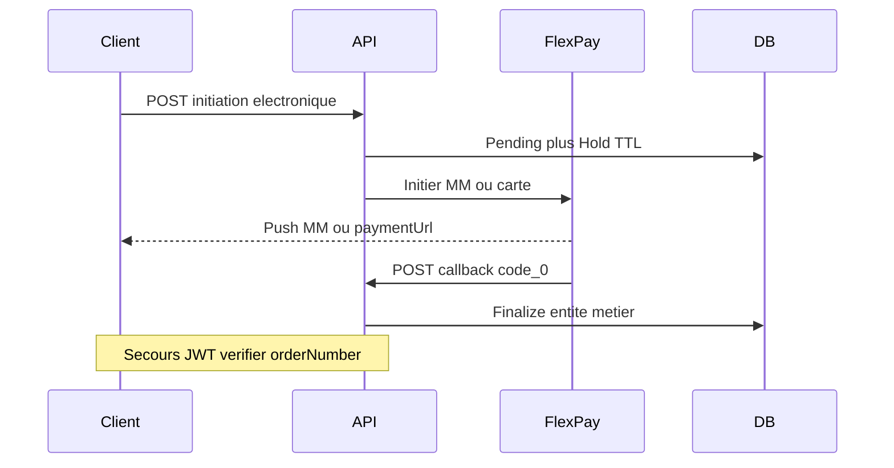

# Guide portable — Intégration FlexPay (paiement électronique)

Documentation **réutilisable** pour intégrer FlexPay (Mobile Money + carte bancaire) dans **une autre API**, en s’appuyant sur l’implémentation ProsocAPI.

**Dernière mise à jour** : juillet 2026  
**Sources** : code Prosoc (`Services/FlexPay*`, `Models/Configuration/FlexPayOptions.cs`) ; historique [Integration-FlexPay-From-RusaTravelAPI.md](../Integration-FlexPay-From-RusaTravelAPI.md)

---

## 1. Résumé exécutif

| Élément | Valeur |
|---------|--------|
| Prestataire | FlexPay (RDC) — Mobile Money, Visa/Mastercard |
| Méthodes électroniques | `MOBILE_MONEY`, `CARTE_BANCAIRE` uniquement |
| Modes hors FlexPay | ESPECE / VIREMENT / CHEQUE / etc. — **endpoint / service séparés** |
| Confirmation | Callback HTTPS public `POST …/callback` avec `code == "0"` |
| Secours | `GET …/verifier/{orderNumber}` (JWT recommandé) |
| Règle métier clé | **Créer l’entité métier seulement après callback succès** |
| Attente | Entité « en attente » + hold TTL (défaut 15 min) |
| Devises FlexPay | `CDF` ou `USD` uniquement |
| Paiement | **Intégral** (montant recalculé serveur ; tolérance configurable) |

### Démarrage rapide (autre projet)

1. Configurer `FlexPay` dans `appsettings` + credentials marchand (DB ou secrets).
2. Porter le client HTTP (`FlexPayService`) : MM, carte, check.
3. Créer le schéma minimal : pending + transaction + callback + hold.
4. Exposer un callback **HTTPS public** accessible depuis Internet.
5. Séparer strictement **CASH / sync** et **électronique / async**.
6. Tester : initiation → callback `code=0` → idempotence (double callback).

---

## 2. Les trois couches (ne pas les mélanger)

| Couche | Portable ? | Contenu |
|--------|------------|---------|
| **A. Contrat FlexPay (prestataire)** | Oui | URLs, payloads, codes, devises |
| **B. Pattern d’intégration** | Oui | hold → pending → callback → finalize + idempotence |
| **C. Métier de votre domaine** | Non | Remplacer la « commande » / adhésion / collecte Prosoc |

Ce qui se porte **presque tel quel** : client HTTP FlexPay, options, tables d’audit, callback + check montant + idempotence.

Ce qui **doit être réécrit** : le finalizer métier (créer l’ordre / billet / adhésion après `code=0`).

---

## 3. Architecture générique



### Couches techniques recommandées

| Couche | Rôle générique | Équivalent Prosoc |
|--------|----------------|-------------------|
| HTTP client | Appels MM / carte / check | `FlexPayService` |
| Initiation | Persist pending + hold + call FlexPay | `FlexPayCollecteService`, `FlexPayAdhesionService` |
| Callback | Audit, idempotence, branchement finalizer | `FlexPayCallbackService` |
| Finalizer | Créer l’entité métier | `FlexPayFinalizationService` |
| Marchand | Token + flags MM/carte | `InfoPaiementMarchand` |
| UX temps réel (optionnel) | SignalR / SSE / polling | `FlexPayHub` |

---

## 4. API FlexPay externe (prestataire)

### 4.1 URLs (défauts Prosoc)

| Usage | URL |
|-------|-----|
| Mobile Money | `https://backend.flexpay.cd/api/rest/v1/paymentService` |
| Carte v1.1 | `https://cardpayment.flexpay.cd/v1.1/pay` |
| Vérification | `https://apicheck.flexpaie.com/api/rest/v1/check/{orderNumber}` |

Header sortant : `Authorization: Bearer {apiToken}` (token marchand FlexPay).

### 4.2 Mobile Money — corps envoyé

```json
{
  "merchant": "CODE_MARCHAND",
  "type": "1",
  "reference": "PS-abc123...",
  "phone": "243900000000",
  "amount": "71250",
  "currency": "CDF",
  "callbackUrl": "https://votre-api.example/api/FlexPay/callback",
  "return_url": "https://votre-api.example/api/FlexPay/callback"
}
```

| Champ | Règle |
|-------|--------|
| `type` | `"1"` = Mobile Money |
| `amount` | **Entier** pour CDF ; décimal pour USD |
| `phone` | Obligatoire (format opérateur RDC) |
| Auth | Header Bearer |

### 4.3 Carte bancaire v1.1 — corps envoyé

```json
{
  "authorization": "Bearer {token}",
  "merchant": "CODE_MARCHAND",
  "reference": "PS-abc123...",
  "amount": 25,
  "currency": "USD",
  "description": "Paiement commande 42",
  "callback_url": "https://.../api/FlexPay/callback",
  "approve_url": "https://.../api/FlexPay/approve",
  "cancel_url": "https://.../api/FlexPay/cancel",
  "decline_url": "https://.../api/FlexPay/decline"
}
```

| Aspect | Mobile Money | Carte |
|--------|--------------|-------|
| Type interne | `"1"` | `"2"` |
| Téléphone | Obligatoire | Non requis |
| Réponse initiation | Push opérateur | **`paymentUrl`** à ouvrir dans le navigateur |
| Pages approve/cancel/decline | — | Informatives uniquement (ne finalisent pas) |

### 4.4 Réponse initiation FlexPay

```json
{
  "code": "0",
  "message": "...",
  "orderNumber": "FP123456789",
  "paymentUrl": "https://..."
}
```

- Succès côté initiation FlexPay : `code == "0"`.
- URLs de paiement possibles : `paymentUrl` | `redirectUrl` | `url` (résoudre dans cet ordre).

### 4.5 Callback FlexPay (entrant)

```json
{
  "code": "0",
  "reference": "PS-abc123...",
  "providerReference": "REF-OPERATEUR",
  "orderNumber": "FP123456789",
  "amount": "71250",
  "amountCustomer": "71250",
  "phone": "243900000000",
  "currency": "CDF",
  "createdAt": "...",
  "channel": "..."
}
```

| `code` | Action |
|--------|--------|
| `"0"` | Paiement OK → finaliser l’entité métier |
| autre | Refus → marquer pending en échec, libérer le hold |

### 4.6 Check transaction (secours)

`GET {CheckTransactionUrl}/{orderNumber}` + Bearer.

Succès si `transaction.status == "0"` ou `code == "0"` → réutiliser la même logique que le callback (synthétique).

---

## 5. Configuration

Section `appsettings` (miroir Prosoc [`FlexPayOptions`](../Models/Configuration/FlexPayOptions.cs)) :

```json
"FlexPay": {
  "Enabled": true,
  "HoldMinutes": 15,
  "CallbackBaseUrl": "https://votre-api.example/api/FlexPay/callback",
  "MobileMoneyUrl": "https://backend.flexpay.cd/api/rest/v1/paymentService",
  "CardPaymentUrl": "https://cardpayment.flexpay.cd/v1.1/pay",
  "CheckTransactionUrl": "https://apicheck.flexpaie.com/api/rest/v1/check",
  "ForceProductionCallbackInDev": false,
  "MontantTolerance": 0.05
}
```

| Clé | Rôle |
|-----|------|
| `CallbackBaseUrl` | URL publique HTTPS (accessible depuis Internet FlexPay) |
| `HoldMinutes` | TTL anti-doublon / expiration pending |
| `MontantTolerance` | Écart max callback vs montant attendu |
| Credentials marchand | **Hors appsettings** (table / vault) : `CodeMarchand` + `ApiToken` + flags MM/carte |

---

## 6. Modèle de données minimal

### Entités à prévoir dans toute API cible

| Entité | Rôle |
|--------|------|
| **Pending** (commande / paiement en attente) | Snapshot métier JSON + montant + devise + `orderNumber` + statut + IDs finalisés |
| **TransactionFlexPay** | Trace de l’appel FlexPay (order, reference, type 1/2, callbacks count) |
| **CallbackFlexPay** | Audit de chaque webhook (payload, headers, IP) |
| **Hold** | Anti-doublon pendant TTL (clé téléphone / ressource / user) |
| **Marchand** | Token API + `actifMobileMoney` / `actifCarteBancaire` |

### Statuts pending recommandés

| Statut | Signification |
|--------|---------------|
| `EnAttente` | Paiement lancé |
| `Finalise` | Entité métier créée |
| `Echec` | Callback `code != "0"` |
| `Expire` | Hold / TTL dépassé sans succès |

### Colonnes d’idempotence critiques sur le pending

- `IdXxxFinalise` (nullable) — si renseigné → second callback = succès idempotent
- `OrderNumberFlexPay` / `ReferenceFlexPay`
- `MontantFlexPay` + `CodeDevisePaiement`

Migrations Prosoc de référence : `20260524224948_AddFlexPayModule`, `20260524230232_AddFlexPayAdhesionFinalisee`.

---

## 7. Contrats API de **votre** côté

### 7.1 Initiation (métier électronique)

1. Valider que le mode est FlexPay (`MOBILE_MONEY` / `CARTE_BANCAIRE`).
2. Recalculer le montant **côté serveur** (ne jamais faire confiance au montant client).
3. Créer hold + pending + enregistrer le payload métier sérialisé.
4. Appeler FlexPay ; stocker `orderNumber`.
5. Répondre au client (typiquement `200` ou `202`) avec au minimum :

```json
{
  "idPending": "guid...",
  "orderNumberFlexPay": "FP...",
  "referenceFlexPay": "PS-...",
  "montantFlexPay": 1500,
  "codeDevisePaiement": "CDF",
  "holdExpireAt": "2026-07-14T12:00:00Z",
  "paymentUrl": null,
  "flexPayAccepted": true,
  "message": "..."
}
```

Pour la carte : `paymentUrl` non null → redirection navigateur.

### 7.2 Callback public

```http
POST /api/FlexPay/callback
Content-Type: application/json
```

- **Sans JWT** (`[AllowAnonymous]`) — FlexPay n’envoie pas de token applicatif.
- Persister l’audit **avant** le traitement métier.
- Pipeline : retrouver transaction/pending → si déjà finalisé → OK idempotent → si `code != "0"` → échec → si `code == "0"` → check montant → finalizer.

Réponse HTTP 200 même en cas de refus métier géré (pour éviter les retries interminables FlexPay) ; distinguer dans le corps `success` / `alreadyProcessed` / message.

### 7.3 Vérifier (secours)

```http
GET /api/FlexPay/verifier/{orderNumber}
Authorization: Bearer {jwt}
```

Appelle l’API check FlexPay puis réutilise `ProcessCallback`.

### 7.4 Pages retour carte (optionnel)

`GET /approve|cancel|decline` — **informatifs seulement**. La création métier reste sur le callback `code=0`.

---

## 8. Règles d’idempotence et montant

| Règle | Pourquoi |
|-------|----------|
| Finalizer une seule fois | FlexPay peut renvoyer 2× le même callback |
| Si `IdFinalise` déjà set → `AlreadyProcessed = true` | Pas de double commande / double collecte |
| Comparer montant callback vs `MontantFlexPay` (± `MontantTolerance`) | Anti-fraude basique |
| Libérer le hold sur échec / expire | Débloquer une nouvelle tentative |
| Incrémenter `NombreCallbacks` | Observabilité / support |

### Séparation CASH / électronique

| Flux | Comportement |
|------|--------------|
| CASH / sync | Création immédiate des entités ; **interdire** MM/carte |
| Électronique | **Interdire** ESPECE etc. ; ne créer qu’au callback |

Helper Prosoc : [`Helpers/MethodePaiementHelper.cs`](../Helpers/MethodePaiementHelper.cs) (`IsFlexPay`, alias `ORANGE_MONEY` → `MOBILE_MONEY`, `CARD` → `CARTE_BANCAIRE`).

---

## 9. Sécurité du callback

Dans Prosoc, le callback est public **sans HMAC / signature**.

**Minimum obligatoire** pour une nouvelle API :

1. HTTPS + `CallbackBaseUrl` fixe et connu
2. Contrôle montant + devise
3. Idempotence stricte
4. Audit payload / IP / headers

**Durcissement recommandé** (si le contexte le permet) :

- Allowlist IP FlexPay (demander la liste au prestataire)
- Rate limiting sur `/callback`
- Ne pas exposer d’IDs métier secrets dans `reference` si possible
- SignalR / groupes publics : le GUID pending joue le rôle de secret faible

---

## 10. Checklist de portage vers votre API

Remplacez mentalement *Commande* / *Réservation* / *Adhésion* par votre agrégat.

- [ ] Section `FlexPay` + client HTTP dédié (`AddHttpClient("FlexPay")`)
- [ ] Table / store marchand (token jamais renvoyé en clair dans les API admin)
- [ ] Entité pending + hold TTL
- [ ] Tables `TransactionFlexPay` / `CallbackFlexPay` (audit)
- [ ] Endpoint initiation électronique séparé du flux CASH
- [ ] `POST /callback` HTTPS public + pipeline idempotent
- [ ] `GET /verifier/{orderNumber}` (JWT)
- [ ] Finalizer = **uniquement** votre création métier après `code=0`
- [ ] Alias modes de paiement normalisés
- [ ] Tests : succès, refus, double callback, écart de montant
- [ ] (Optionnel) temps réel SignalR / SSE ; sinon polling `verifier`
- [ ] Multi-devise : convertir avant l’appel FlexPay ; stocker taux appliqué

### Ce qu’il ne faut **pas** porter tel quel depuis Prosoc

| Spécifique Prosoc | Remplacer par |
|-------------------|---------------|
| `CollecteEnAttente` + 4 `SourceFlux` | Votre pending + enum de flux |
| Finalization adhésion / collecte / caisse | Votre `FinalizeOrderAsync` |
| `InfoPaiementMarchand` org-unique | 1 marchand / tenant / site selon votre modèle |
| SignalR `FlexPayHub` | Optionnel |
| Règles tarif cotisation / type adhésion | Votre pricing |

---

## 11. Annexe Prosoc (exemple d’adaptation)

> Cette section décrit **comment Prosoc applique** le pattern. Elle n’est pas un contrat obligatoire pour une autre API.

### 11.1 Flux métier Prosoc (`CollecteEnAttenteSourceFlux`)

| Source | Endpoint | Auth | HTTP | Préfixe ref. | Finalisation |
|--------|----------|------|------|--------------|--------------|
| `CollecteAgent` | `POST /api/Collecte` | JWT | `200` | `PS-` | Collecte agent |
| `CollectePaiementElectroniquePublic` | `POST /api/Collecte/with-paiement-electronique` | Anon | `202` | `PS-` | Collecte publique |
| `PaiementAffilie` | `POST /api/Affilie/paiement` | JWT affilié | `200` | `PS-` | Paiement affilié |
| `AdhesionWithAffilie` | `POST /api/Adhesion/with-affilie-paiement-electronique` | Anon | `202` | `AD-` | Adhésion + collectes |

Règle commune : **aucune** ligne `Collecte` / `Adhesion` avant callback `code=0`. Statut paiement persisté à la création : `VALIDE`.

### 11.2 Endpoints FlexPay Prosoc

| Méthode | Route | Auth |
|---------|-------|------|
| `POST` | `/api/FlexPay/callback` | Anon |
| `GET` | `/api/FlexPay/verifier/{orderNumber}` | JWT |
| `GET` | `/api/FlexPay/approve\|cancel\|decline` | Anon (info) |
| CRUD | `/api/InfoPaiementMarchand` | Admin / Financier |

### 11.3 Fichiers source à lire en priorité

| Fichier | Rôle |
|---------|------|
| [`Services/FlexPayService.cs`](../Services/FlexPayService.cs) | Client HTTP prestataire |
| [`Services/FlexPayCallbackService.cs`](../Services/FlexPayCallbackService.cs) | Pipeline callback + vérif |
| [`Services/FlexPayFinalizationService.cs`](../Services/FlexPayFinalizationService.cs) | Création métier |
| [`Services/FlexPayCollecteService.cs`](../Services/FlexPayCollecteService.cs) | Initiation collecte |
| [`Services/FlexPayAdhesionService.cs`](../Services/FlexPayAdhesionService.cs) | Initiation adhésion |
| [`Controllers/FlexPayController.cs`](../Controllers/FlexPayController.cs) | Routes callback / verifier |
| [`Models/Configuration/FlexPayOptions.cs`](../Models/Configuration/FlexPayOptions.cs) | Config |
| [`Models/DTOs/FlexPay/FlexPayDtos.cs`](../Models/DTOs/FlexPay/FlexPayDtos.cs) | Contrats DTO |
| [`Helpers/MethodePaiementHelper.cs`](../Helpers/MethodePaiementHelper.cs) | CASH vs FlexPay |
| [`Helpers/FlexPayUrlHelper.cs`](../Helpers/FlexPayUrlHelper.cs) | Résolution URLs callback / retour |

### 11.4 Différences vs guide RusaTravel

| Sujet | RusaTravel (doc historique) | Prosoc |
|-------|----------------------------|--------|
| Pending | `CommandeReservationEnAttente` + holds sièges | `CollecteEnAttente` |
| Marchand | 1 config **par site** | 1 config **active** organisation |
| Métier après paiement | Réservation + billets | Collecte et/ou Adhésion |
| Temps réel | selon front | SignalR `/flexPayHub` |

Doc historique : [Integration-FlexPay-From-RusaTravelAPI.md](../Integration-FlexPay-From-RusaTravelAPI.md) (certains liens internes y sont cassés / hors repo).

### 11.5 Documentation Prosoc complémentaire

| Document | Contenu |
|----------|---------|
| [API-DOCUMENTATION-NEW.md](../API-DOCUMENTATION-NEW.md) — section FlexPay | Endpoints, config, SignalR, MM vs carte |
| [FRONTEND_INTEGRATION_ADHESION_FLEXPAY.md](../FRONTEND_INTEGRATION_ADHESION_FLEXPAY.md) | Front adhésion électronique |
| [FRONTEND_INTEGRATION_COLLECTE_FLEXPAY.md](../FRONTEND_INTEGRATION_COLLECTE_FLEXPAY.md) | Front collecte électronique |
| [PROCESSUS_ADHESION_EN_LIGNE_ET_AFFECTATION_AGENT.md](../PROCESSUS_ADHESION_EN_LIGNE_ET_AFFECTATION_AGENT.md) | Métier adhésion en ligne post-paiement |

### 11.6 Tests Prosoc utiles comme modèles

- `Prosoc.Tests.Integration/FlexPay/FlexPayCallbackIntegrationTests.cs`
- `Prosoc.Tests.Integration/FlexPay/FlexPayStubService.cs`
- `Prosoc.Tests.Unit/Helpers/FlexPayUrlHelperTests.cs`

---

## 12. Glossaire

| Terme | Définition |
|-------|------------|
| **Pending** | Enregistrement d’un paiement électronique non encore confirmé |
| **Hold** | Verrou temporaire anti-doublon pendant TTL |
| **orderNumber** | Identifiant FlexPay de la transaction |
| **reference** | Identifiant métier envoyé à FlexPay (préfixe libre : `PS-`, `AD-`, …) |
| **Finalize** | Création des entités métier après `code=0` |
| **Idempotence** | Deux callbacks identiques → une seule création métier |

---

## 13. Checklist de validation (recette)

1. Config marchand active + flags MM / carte.
2. Initiation MM → push reçu → callback `code=0` → entité créée une fois.
3. Double callback → `alreadyProcessed`, pas de second enregistrement.
4. Callback `code=1` → pending en échec, hold libéré, pas d’entité.
5. Écart montant hors tolérance → rejet / pas de finalisation.
6. Carte → `paymentUrl` → pages approve informatives → finalisation seulement au callback.
7. `verifier/{orderNumber}` finalise si FlexPay dit payé et pending encore ouvert.
8. Flux CASH refuse MM/carte ; flux électronique refuse ESPECE.
