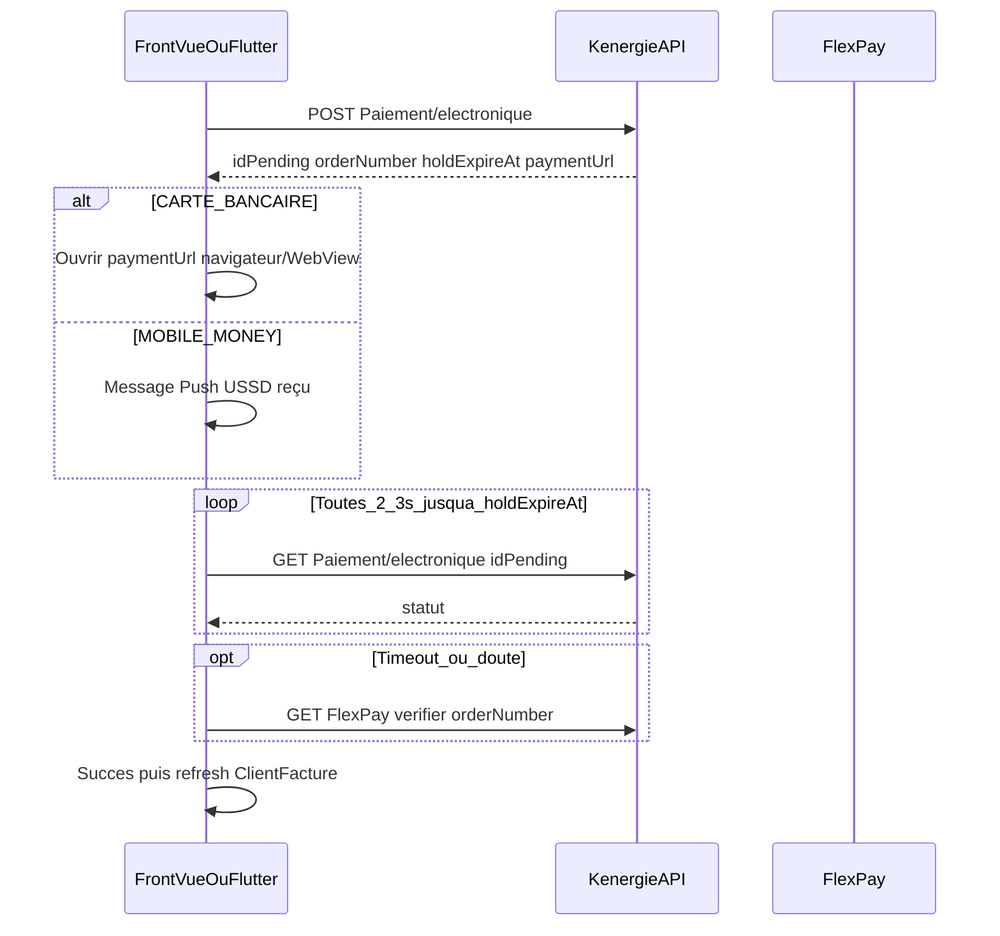

# Guide d'intégration Frontend — Multi-devises & FlexPay

Documentation **orientée front** pour intégrer les modules **Multi-devises** et **Paiement électronique FlexPay** dans :

- **Web** : Vue.js 3 (Composition API)
- **Mobile** : Flutter

Références API détaillées :
- [`API_DOCUMENTATION_MULTIDEVISE.md`](./API_DOCUMENTATION_MULTIDEVISE.md)
- [`API_DOCUMENTATION_FLEXPAY.md`](./API_DOCUMENTATION_FLEXPAY.md)

**Base URL** : `{API_BASE}` (ex. `https://api.kenergie.example`)  
**Auth** : header `Authorization: Bearer {jwt}` sur toutes les routes sauf le callback FlexPay (serveur uniquement).

---

## 1. Principes communs (Web + Mobile)

### 1.1 Multi-devises

| Règle | Impact UI |
|-------|-----------|
| Une devise principale par société (`codeDevisePrincipale`) | Afficher le symbole / code sur dashboards & stats |
| Montants en devise d’origine **et** devise principale | Afficher les deux quand l’origine ≠ principale |
| Paiement CASH = même devise que la facture | Bloquer le submit si mismatch |
| Stats / dashboards déjà consolidés côté API | Afficher `codeDevisePrincipale` + montant retourné |
| Équivalent USD indicatif (`syntheseUsd`) | Afficher `montantEquivalentUsd` seulement si `conversionUsdDisponible` |

`Societe.Devise` = slogan. Ne pas l’utiliser comme code ISO. Utiliser `codeDevisePrincipale`.

Guide dashboards / stats USD : [`FRONTEND_INTEGRATION_RAPPORT_USD.md`](./FRONTEND_INTEGRATION_RAPPORT_USD.md)

### 1.2 FlexPay vs CASH

| Flux | Endpoint | UX |
|------|----------|-----|
| Espèces / virement / chèque | `POST /api/Paiement` ou sync offline | Création immédiate |
| Mobile Money / Carte | `POST /api/Paiement/electronique` | Pending → polling → succès/échec |

**Ne jamais** envoyer `Mobile Money` / `Carte` / `MOBILE_MONEY` sur `POST /api/Paiement` (HTTP 400).

### 1.3 Devises FlexPay

FlexPay n’accepte que **CDF** et **USD** comme **devise de paiement**. La facture peut être dans une autre devise si Kenergie dispose d’un taux interne pour convertir vers CDF/USD au moment de l’initiation.

Règles métier cross-devise :

- La **facture fait foi** : `montant` envoyé à l’API reste un montant exprimé dans la devise de la facture.
- `codeDevisePaiement` peut être différent de `ClientFacture.codeDevisePrix`.
- Kenergie fige le taux interne à l’initiation, calcule le montant à débiter côté wallet, puis valide le callback contre ce snapshot figé.
- CASH reste strict : `codeDevisePaiement` doit toujours correspondre à la devise de la facture.

---

## 2. Endpoints à brancher

### 2.1 Multi-devises

| Action | Méthode | Route | Rôles typiques |
|--------|---------|-------|----------------|
| Lister devises actives | GET | `/api/Devise/devises` | Caissier, Financier, Admin, Gérant, Super-Admin…, **Client** (lecture, société du client) |
| Créer devise | POST | `/api/Devise/devises` | Admin, Gérant, Super-Admin |
| Modifier devise | PUT | `/api/Devise/devises/{id}` | Admin, Gérant, Super-Admin |
| Devise principale | PUT | `/api/Devise/societe/{idSociete}/devise-principale/{code}` | Admin, Gérant, Super-Admin |
| Créer taux | POST | `/api/Devise/taux-change` | Admin, Gérant, Super-Admin |
| Lister taux | GET | `/api/Devise/taux-change` (`idSociete`, `source`, `cible` optionnels) | même lecture que liste devises |
| Preview conversion | GET | `/api/Devise/preview-conversion?...` | même lecture que liste devises |

### 2.2 Facturation / paiement CASH (champs nouveaux)

À ajouter dans vos payloads existants :

- Facture (création / bulk) : `codeDevisePrix` (optionnel, défaut = principale)
- Arriéré : `codeDevisePrix`
- Paiement CASH : `codeDevisePaiement` (doit = devise facture)
- Sync batch offline : `codeDevisePaiement` par item

### 2.3 FlexPay

| Action | Méthode | Route | Rôles |
|--------|---------|-------|-------|
| Config marchand CRUD | `/api/InfoPaiementSociete` | Admin, Financier, Super-Admin |
| Initier paiement | POST | `/api/Paiement/electronique` | Caissier, Financier, Admin…, **Client** (`Paiement.Create`, ses factures) |
| Statut pending | GET | `/api/Paiement/electronique/{idPending}` | idem + **Client** (uniquement ses propres pending) |
| Vérifier (secours) | GET | `/api/FlexPay/verifier/{orderNumber}` | idem + **Client** (ses paiements) |

Le callback `POST /api/FlexPay/callback` est **serveur ↔ FlexPay** : aucune intégration côté app.

---

## 3. Modèles TypeScript / Dart (contrat partagé)

### 3.1 Devise

```ts
// TypeScript (Vue)
export interface DeviseDto {
  idDeviseMonetaire: number
  idSociete: number
  codeDevise: string       // "CDF" | "USD" | "EUR"…
  libelle: string
  symbole?: string
  statut: boolean
  estDevisePrincipale: boolean
}
```

```dart
// Dart (Flutter)
class DeviseDto {
  final int idDeviseMonetaire;
  final int idSociete;
  final String codeDevise;
  final String libelle;
  final String? symbole;
  final bool statut;
  final bool estDevisePrincipale;
  // fromJson / toJson…
}
```

### 3.2 Pending FlexPay

```ts
export interface PaiementElectroniquePendingDto {
  idPending: number
  orderNumberFlexPay?: string
  referenceFlexPay: string
  montantFlexPay: number
  codeDevisePaiement: string
  methode: string              // MOBILE_MONEY | CARTE_BANCAIRE
  statut: string               // EnAttente | Finalise | Echec | Expire
  holdExpireAt: string         // ISO
  paymentUrl?: string | null
  flexPayAccepted: boolean
  estConfirme: boolean           // true seulement si statut === Finalise
  idPaiementFinalise?: number | null
  dateFinalisation?: string | null
  message?: string
}
```

**Ne jamais** traiter `flexPayAccepted=true` comme paiement réussi. Attendre `estConfirme=true` ou `statut=Finalise` (polling ou SignalR `PaiementElectroniqueStatusChanged`).

Statuts UI recommandés :

| `statut` | Label front | Action |
|----------|-------------|--------|
| `EnAttente` | En attente de confirmation | Polling |
| `Finalise` | Payé | Fermer + rafraîchir facture |
| `Echec` | Échec | Proposer nouvel essai |
| `Expire` | Expiré | Proposer nouvel essai |

---

## 4. Parcours UX recommandés

### 4.1 Admin — devises & taux

1. Charger `GET /api/Devise/devises`
2. Afficher la principale (badge)
3. Créer devises secondaires (ex. USD)
4. Saisir taux bidirectionnels USD↔CDF avant d’émettre des factures en devise secondaire
5. Avant validation d’une facture non-principale : appeler `preview-conversion` et afficher estimation

### 4.2 Facturation

1. Select devise (`codeDevisePrix`) prérempli avec la principale
2. Si ≠ principale → afficher preview de conversion
3. Après création, afficher montant origine + montant principale si différents

### 4.3 Encaissement CASH

1. Lire `ClientFacture.codeDevisePrix` / `montantDu`
2. Forcer `codeDevisePaiement` = devise facture (input readonly ou select à 1 option)
3. `POST /api/Paiement` (pas FlexPay)

### 4.4 Encaissement FlexPay (MM / carte)



---

## 5. Vue.js 3 — guide d’intégration

### 5.1 Service HTTP (exemple `composables` / `services`)

```ts
// services/deviseApi.ts
import { api } from '@/plugins/axios' // instance avec JWT

export const deviseApi = {
  listActives: () => api.get('/api/Devise/devises'),
  create: (body: any) => api.post('/api/Devise/devises', body),
  update: (id: number, body: any) => api.put(`/api/Devise/devises/${id}`, body),
  setPrincipale: (idSociete: number, code: string) =>
    api.put(`/api/Devise/societe/${idSociete}/devise-principale/${code}`),
  createTaux: (body: any) => api.post('/api/Devise/taux-change', body),
  listTaux: (params?: { idSociete?: number; source?: string; cible?: string }) =>
    api.get('/api/Devise/taux-change', { params }),
  preview: (params: {
    idSociete: number
    codeDeviseSource: string
    montant: number
    datePaiement?: string
  }) => api.get('/api/Devise/preview-conversion', { params }),
}
```

```ts
// services/flexPayApi.ts
export const flexPayApi = {
  initier: (body: any) => api.post('/api/Paiement/electronique', body),
  getPending: (id: number) => api.get(`/api/Paiement/electronique/${id}`),
  verifier: (orderNumber: string) => api.get(`/api/FlexPay/verifier/${orderNumber}`),
  listMarchands: () => api.get('/api/InfoPaiementSociete'),
  createMarchand: (body: any) => api.post('/api/InfoPaiementSociete', body),
}
```

### 5.2 Store Pinia — devises (extrait)

```ts
export const useDeviseStore = defineStore('devise', {
  state: () => ({
    devises: [] as DeviseDto[],
    loading: false,
  }),
  getters: {
    principale: (s) => s.devises.find((d) => d.estDevisePrincipale) ?? null,
    codePrincipale: (s) => s.devises.find((d) => d.estDevisePrincipale)?.codeDevise ?? 'CDF',
  },
  actions: {
    async load() {
      this.loading = true
      try {
        const { data } = await deviseApi.listActives()
        this.devises = data
      } finally {
        this.loading = false
      }
    },
  },
})
```

### 5.3 Composable polling FlexPay

```ts
// composables/useFlexPayPolling.ts
import { ref, onUnmounted } from 'vue'
import { flexPayApi } from '@/services/flexPayApi'

export function useFlexPayPolling() {
  const pending = ref<PaiementElectroniquePendingDto | null>(null)
  const error = ref<string | null>(null)
  let timer: number | undefined

  async function start(idPending: number, orderNumber?: string) {
    stop()
    const tick = async () => {
      const { data } = await flexPayApi.getPending(idPending)
      pending.value = data
      if (['Finalise', 'Echec', 'Expire'].includes(data.statut)) {
        stop()
        return
      }
      if (orderNumber && Date.now() > Date.parse(data.holdExpireAt)) {
        await flexPayApi.verifier(orderNumber)
        const again = await flexPayApi.getPending(idPending)
        pending.value = again.data
        stop()
      }
    }
    await tick()
    timer = window.setInterval(tick, 2500)
  }

  function stop() {
    if (timer) window.clearInterval(timer)
    timer = undefined
  }

  onUnmounted(stop)
  return { pending, error, start, stop }
}
```

### 5.4 Écran paiement (Vue) — logique

```ts
async function payerCash() {
  await api.post('/api/Paiement', {
    idClientFacture: facture.idClientFacture,
    montantPaye: montant,
    methodePaiement: 'Espèces',
    codeDevisePaiement: facture.codeDevisePrix, // obligatoire = devise facture
  })
}

async function payerMobileMoney(telephone: string) {
  const { data } = await flexPayApi.initier({
    idClientFacture: facture.idClientFacture,
    methode: 'MOBILE_MONEY',
    telephone, // ex. 2439…
    codeDevisePaiement: deviseWalletChoisie, // "CDF" ou "USD"
    montant: montantSaisi, // optionnel, toujours exprimé dans la devise de la facture
  })
  if (data.methode === 'CARTE_BANCAIRE' && data.paymentUrl) {
    window.open(data.paymentUrl, '_blank')
  }
  await startPolling(data.idPending, data.orderNumberFlexPay)
}
```

### 5.5 Affichage montants

```vue
<template>
  <div>
    <p>{{ formatMoney(montant, codeDevisePrix) }}</p>
    <p v-if="codeDevisePrix !== codeDevisePrincipale" class="muted">
      ≈ {{ formatMoney(montantDevisePrincipale, codeDevisePrincipale) }}
    </p>
  </div>
</template>
```

Helper :

```ts
function formatMoney(value: number, code: string) {
  return new Intl.NumberFormat('fr-CD', {
    style: 'currency',
    currency: code === 'CDF' ? 'CDF' : code,
    maximumFractionDigits: code === 'CDF' ? 0 : 2,
  }).format(value)
}
```

### 5.6 Écrans Vue à prévoir

| Écran | Contenu |
|-------|---------|
| Admin Devises | Liste, CRUD, bascule principale |
| Admin Taux | Formulaire paire + dateEffet |
| Admin Marchand FlexPay | Code marchand + **JWT seul** (sans `Bearer `) ; jamais réafficher le token après save ; utiliser `hasApiToken` |

**Token marchand (`apiToken`)** — distinct du JWT de connexion Kenergie :

```text
✅ Correct : eyJ0eXAiOiJKV1QiLCJhbGciOiJIUzI1NiJ9....
❌ Incorrect : Bearer eyJ0eXAiOiJKV1QiLCJhbGciOiJIUzI1NiJ9....
```

L’API ajoute automatiquement le préfixe `Bearer` vers FlexPay. Si vous le stockez aussi, FlexPay reçoit `Bearer Bearer …` et peut renvoyer une erreur Base64.
| Facture create | Select devise + preview |
| Encaissement | Onglets CASH / Mobile Money / Carte |
| Pending paiement | Spinner + statut + bouton « Vérifier » |

---

## 6. Flutter — guide d’intégration

### 6.1 Client HTTP

Utiliser `Dio` (ou `http`) avec intercepteur JWT.

```dart
class DeviseApi {
  DeviseApi(this._dio);
  final Dio _dio;

  Future<List<DeviseDto>> listActives() async {
    final res = await _dio.get('/api/Devise/devises');
    return (res.data as List).map((e) => DeviseDto.fromJson(e)).toList();
  }

  Future<Map<String, dynamic>> preview({
    required int idSociete,
    required String codeDeviseSource,
    required double montant,
  }) async {
    final res = await _dio.get('/api/Devise/preview-conversion', queryParameters: {
      'idSociete': idSociete,
      'codeDeviseSource': codeDeviseSource,
      'montant': montant,
    });
    return res.data as Map<String, dynamic>;
  }
}
```

```dart
class FlexPayApi {
  FlexPayApi(this._dio);
  final Dio _dio;

  Future<PaiementElectroniquePendingDto> initier(Map<String, dynamic> body) async {
    final res = await _dio.post('/api/Paiement/electronique', data: body);
    return PaiementElectroniquePendingDto.fromJson(res.data);
  }

  Future<PaiementElectroniquePendingDto> getPending(int id) async {
    final res = await _dio.get('/api/Paiement/electronique/$id');
    return PaiementElectroniquePendingDto.fromJson(res.data);
  }

  Future<Map<String, dynamic>> verifier(String orderNumber) async {
    final res = await _dio.get('/api/FlexPay/verifier/$orderNumber');
    return res.data as Map<String, dynamic>;
  }
}
```

### 6.2 Polling (Timer)

```dart
class FlexPayPollingController {
  Timer? _timer;

  void start({
    required int idPending,
    String? orderNumber,
    required Future<PaiementElectroniquePendingDto> Function(int) fetch,
    required Future<void> Function(String) verifier,
    required void Function(PaiementElectroniquePendingDto) onUpdate,
  }) {
    _timer?.cancel();
    _timer = Timer.periodic(const Duration(seconds: 3), (_) async {
      final p = await fetch(idPending);
      onUpdate(p);
      if (const {'Finalise', 'Echec', 'Expire'}.contains(p.statut)) {
        stop();
        return;
      }
      if (orderNumber != null && DateTime.now().isAfter(p.holdExpireAt)) {
        await verifier(orderNumber);
        onUpdate(await fetch(idPending));
        stop();
      }
    });
  }

  void stop() {
    _timer?.cancel();
    _timer = null;
  }
}
```

### 6.3 Mobile Money vs Carte

```dart
Future<void> payElectronic({
  required int idClientFacture,
  required String methode, // MOBILE_MONEY | CARTE_BANCAIRE
  String? telephone,
  required String codeDevise,
  double? montant,
}) async {
  final pending = await flexPayApi.initier({
    'idClientFacture': idClientFacture,
    'methode': methode,
    'telephone': telephone,
    'codeDevisePaiement': codeDevise,
    if (montant != null) 'montant': montant,
  });

  if (methode == 'CARTE_BANCAIRE' && (pending.paymentUrl?.isNotEmpty ?? false)) {
    // url_launcher ou WebView
    await launchUrl(Uri.parse(pending.paymentUrl!), mode: LaunchMode.externalApplication);
  } else {
    // Afficher: "Validez le push USSD / Mobile Money sur votre téléphone"
  }

  polling.start(
    idPending: pending.idPending,
    orderNumber: pending.orderNumberFlexPay,
    fetch: flexPayApi.getPending,
    verifier: (o) async { await flexPayApi.verifier(o); },
    onUpdate: (p) => setState(() => current = p),
  );
}
```

### 6.4 Offline sync (Flutter)

Pour les paiements **CASH** offline (batch sync existant) :

- ajouter `codeDevisePaiement` (= devise de la `ClientFacture` locale)
- **ne pas** mettre en file offline un paiement FlexPay (async réseau obligatoire)

### 6.5 Formatage CDF / USD (Flutter)

```dart
String formatMoney(num value, String code) {
  if (code == 'CDF') {
    return '${value.toStringAsFixed(0)} FC';
  }
  return '${value.toStringAsFixed(2)} $code';
}
```

### 6.6 Écrans Flutter à prévoir

| Écran | Notes |
|-------|-------|
| `DeviseListPage` | Admin |
| `TauxChangeFormPage` | Admin |
| `MarchandFlexPayPage` | Token en `TextFormField` obscure ; coller le **JWT seul** (sans `Bearer `) ; après save afficher seulement « Token configuré » |
| `EncaissementPage` | Tabs Espèces / MM / Carte |
| `PaiementPendingPage` | Progress + statut + bouton Vérifier |
| Affichage facture | Double montant si besoin |

Permissions / rôles : masquer Admin Devises / Marchand selon le JWT (`Admin`, `Gerant`, `Financier`, `Caissier`).

---

## 7. Gestion d’erreurs (mapping HTTP)

| HTTP | Cas fréquent | Message UI suggéré |
|------|--------------|--------------------|
| 400 | Devise de paiement non supportée / taux introuvable | « Paiement électronique indisponible pour cette combinaison de devises » |
| 400 | FlexPay sur `/api/Paiement` | « Utilisez le paiement électronique » |
| 400 | Hold encore actif | « Un paiement est déjà en cours pour cette facture » |
| 400 | FlexPay disabled / marchand | « Paiement électronique indisponible » |
| 400 | Message Base64 / « FlexPay a refusé l'initiation » | Token marchand mal formé : retirer le préfixe `Bearer ` dans `apiToken`, resauvegarder le marchand |
| 200 puis pending `Echec` | « Écart de montant hors tolérance… » | **Pas l’init** : le callback/vérifier a échoué la validation. L’API compare `amount` FlexPay (montant marchand) à `pending.Montant` (± `MontantTolerance`, défaut 0,05). Afficher `messageErreur` complet (attendu / reçu / delta). Vérifier le payload `CallbacksFlexPay` |
| 403 | Hors société | « Accès refusé » |
| 404 | Pending / facture | « Ressource introuvable » |
| 409 | Devise déjà existante | « Cette devise existe déjà » |

Toujours afficher `response.data.message` quand présent.

**Ne pas confondre** : `Authorization: Bearer {jwt}` de l’app (session utilisateur Kenergie) ≠ `apiToken` marchand FlexPay (credentials `InfoPaiementSociete`).

**Écart hors tolérance** : FlexPay a souvent `code=0` (paiement OK) mais Kenergie refuse de finaliser si `|amount - pending.Montant| > MontantTolerance`. La comparaison utilise le champ marchand `amount` (pas `amountCustomer`, qui peut inclure des frais). En cross-devise, `pending.Montant` correspond au **montant débité attendu dans la devise payeur**, calculé au moment de l’initiation.

---

## 8. Checklist QA front

### Multi-devises

- [ ] Liste devises + badge principale
- [ ] Création USD + taux USD→CDF / CDF→USD
- [ ] Preview conversion avant facture
- [ ] Facture en USD affiche snapshot principale
- [ ] Paiement CASH USD refusé sur facture CDF
- [ ] Dashboard montre `codeDevisePrincipale`

### FlexPay

- [ ] Config marchand (JWT **sans** `Bearer ` ; token non relu en clair)
- [ ] Init MM → pending EnAttente → Finalise après paiement réel/test
- [ ] Init carte → ouverture `paymentUrl`
- [ ] Polling s’arrête sur Finalise / Echec / Expire
- [ ] Bouton « Vérifier » appelle `/verifier/{orderNumber}`
- [ ] CASH avec méthode Mobile Money → erreur claire
- [ ] Facture dans une devise non CDF/USD + taux interne disponible → init FlexPay possible en CDF/USD
- [ ] Facture hors CDF/USD sans taux interne → erreur claire côté UI/API

---

## 9. Ordre d’implémentation front suggéré

1. Modèles + services API Multi-devises  
2. UI Admin devises / taux  
3. Brancher `codeDevisePrix` / affichage double montant factures  
4. Brancher `codeDevisePaiement` sur CASH + sync Flutter  
5. UI Admin marchand FlexPay  
6. Parcours encaissement MM + polling  
7. Parcours carte (`paymentUrl`)  
8. Polish erreurs + checklist QA  

---

## 10. Exemples cURL utiles (debug)

```bash
# Devises
curl -H "Authorization: Bearer $JWT" "$API/api/Devise/devises"

# Preview
curl -H "Authorization: Bearer $JWT" \
  "$API/api/Devise/preview-conversion?idSociete=1&codeDeviseSource=USD&montant=10"

# Init FlexPay MM
curl -X POST -H "Authorization: Bearer $JWT" -H "Content-Type: application/json" \
  -d '{"idClientFacture":123,"methode":"MOBILE_MONEY","telephone":"243900000000","codeDevisePaiement":"CDF"}' \
  "$API/api/Paiement/electronique"

# Statut
curl -H "Authorization: Bearer $JWT" "$API/api/Paiement/electronique/1"
```
